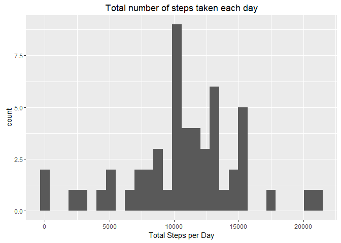
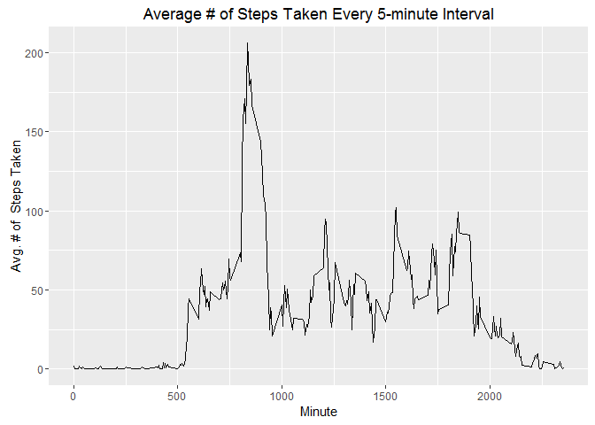
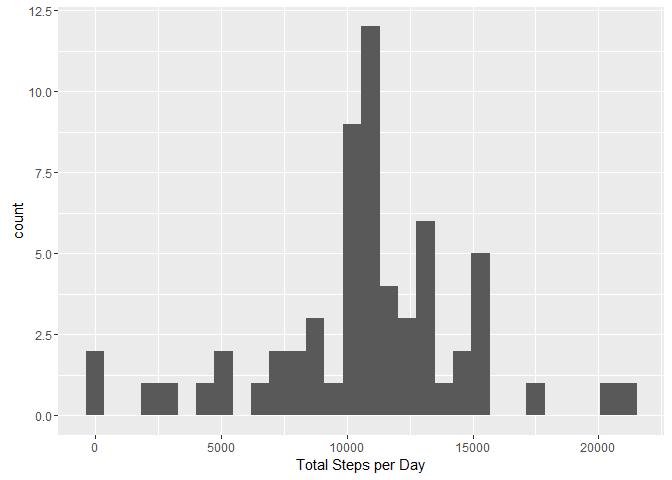
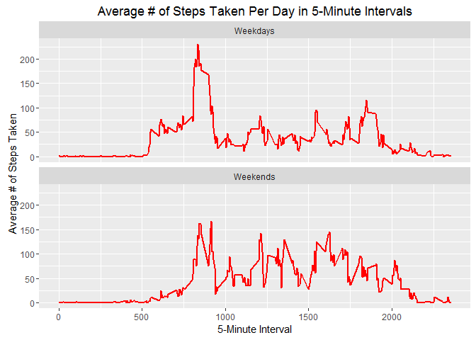

# Reproducible Research: Peer Assessment 1
### Load required packages

```r
library(ggplot2)
```

```
## Warning: package 'ggplot2' was built under R version 3.1.3
```

```r
library(knitr)
```

```
## Warning: package 'knitr' was built under R version 3.1.3
```

```r
library(lubridate)
```

```
## Warning: package 'lubridate' was built under R version 3.1.3
```

```
## 
## Attaching package: 'lubridate'
```

```
## The following object is masked from 'package:base':
## 
##     date
```

### Set working directory 

```r
setwd("H:/Home/grrrl/vajraGrrrl GitHub/RepData_PeerAssessment1/")
getwd()
```

```
## [1] "H:/Home/grrrl/vajraGrrrl GitHub/RepData_PeerAssessment1"
```
# Loading and preprocessing the data

## Check for archive on hard drive - if missing, download

```r
if (!file.exists("activity.zip")) {
fileurl <- "https://d396qusza40orc.cloudfront.net/repdata/data/activity.zip"
download.file(fileurl,destfile="activity.zip",method="curl")
}
```

## Check for unzipped file on hard drive - if missing, unzip archive

```r
if (!file.exists("/activity/activity.csv")) {
  unzip("activity.zip")
}
```
## Load data

```r
r1 <- read.csv("activity.csv",colClasses = c("numeric","POSIXct","numeric"))
```
# What is mean total number of steps taken per day?

## Summarize the number of steps by day (removing missing values)

```r
sumStepsByDay <- aggregate(r1$step ~ r1$date, r1, sum, na.rm=TRUE)
colnames(sumStepsByDay) <- c("date", "total.steps")
```

## Plot a histogram to visualize data

```r
meanStepsByDayPlot <-ggplot(sumStepsByDay, aes(total.steps))
meanStepsByDayPlot  + geom_histogram() + xlab("Total Steps per Day") + ggtitle("Total number of steps taken each day")
```

```
## `stat_bin()` using `bins = 30`. Pick better value with `binwidth`.
```

<!-- -->

## Calculate and view mean

```r
meanStepsByDay <- mean(sumStepsByDay$total.steps)
meanStepsByDay
```

```
## [1] 10766.19
```

## Calculate and view median

```r
medianStepsByDay <- median(sumStepsByDay$total.steps)
medianStepsByDay
```

```
## [1] 10765
```
# What is the average daily activity pattern?
## Make a time series plot (i.e. type = "l") of the 5-minute interval (x-axis) and the average number of steps taken, averaged across all days (y-axis)

```r
intervalAvg <- aggregate(x=r1$steps,by=list(r1$interval),FUN = mean, na.rm=TRUE)
ggplot(data=intervalAvg, aes(x=Group.1, y=x)) + geom_line() +  ylab("Avg. # of  Steps Taken") +  xlab("Minute") + ggtitle("Average # of Steps Taken Every 5-minute Interval")
```

<!-- -->

## Which 5-minute interval, on average across all the days in the dataset, contains the maximum number of steps?

```r
intervalAvg[which(intervalAvg$x== max(intervalAvg$x)),"Group.1"]
```

```
## [1] 835
```
# Calculate the number of missing values


```r
naCount<-sum(is.na(r1$steps))
naCount
```

```
## [1] 2304
```

# Imputing missing values

```r
imputedValues<-tapply(r1$steps,r1$interval,FUN=mean,na.rm=TRUE)
values<-names(imputedValues)
n<-length(values)
for(i in 1:n){
   r1$steps[which(is.na(r1$steps) & r1$interval==values[i])]<- round(imputedValues[i],digits=0) 
}
```
## Populate dataset with imputed summary values

```r
sumStepsByDayImputed <- aggregate(r1$steps,by = list(day=r1$date),FUN=sum, na.rm=TRUE)
colnames(sumStepsByDayImputed) <- c("date", "total.steps.imputed")
```

## Generate histogram of total number of steps taken per day

```r
sumStepsByDayImputedPlot <-ggplot(sumStepsByDayImputed, aes(total.steps.imputed))
sumStepsByDayImputedPlot + geom_histogram() + xlab("Total Steps per Day") 
```

```
## `stat_bin()` using `bins = 30`. Pick better value with `binwidth`.
```

<!-- -->

## Calculate and view mean

```r
meanStepsByDayImputed <- mean(sumStepsByDayImputed$total.steps.imputed)
meanStepsByDayImputed
```

```
## [1] 10765.64
```
## Calculate and view median

```r
medianStepsByDayImputed <- median(sumStepsByDayImputed$total.steps.imputed)
medianStepsByDayImputed
```

```
## [1] 10762
```

## Examine impact of change by comparing averages

```r
meanPctChange <- ((meanStepsByDayImputed-meanStepsByDay)/meanStepsByDay)*100
meanPctChange
```

```
## [1] -0.005102409
```

```r
medianPctChange<-((medianStepsByDayImputed-medianStepsByDay)/medianStepsByDay)*100
medianPctChange
```

```
## [1] -0.02786809
```

# Are there differences in activity patterns between weekdays and weekends?

```r
r1$weekDay<- weekdays(as.Date(r1$date)) 
for (i in 1:nrow(r1)){
        if (r1[i,4]=="Sunday"|r1[i,4]=="Saturday") {r1[i,5]<-"Weekends"} else {r1[i,5]<-"Weekdays"}
}
colnames(r1)[5] <-"weekendFlag"
r1$weekendFlag<-as.factor(r1$weekendFlag)
```


## Calculate mean steps for each interval by type of day 

```r
r2 <- aggregate(steps ~ interval + weekendFlag, 
                               data = r1, FUN = mean, na.rm=TRUE)
colnames(r2)[3] <-"avgSteps"
```

## Create a multi-panel line plot of steps by type of day for comparison

```r
ggplot(r2, aes(x = interval, y = avgSteps)) + 
  geom_line(color="red", lwd=1) + 
  labs(x = "5-Minute Interval", y = "Average # of Steps Taken") +
  ggtitle("Average # of Steps Taken Per Day in 5-Minute Intervals") +
  facet_wrap(~weekendFlag, ncol=1)
```

<!-- -->

